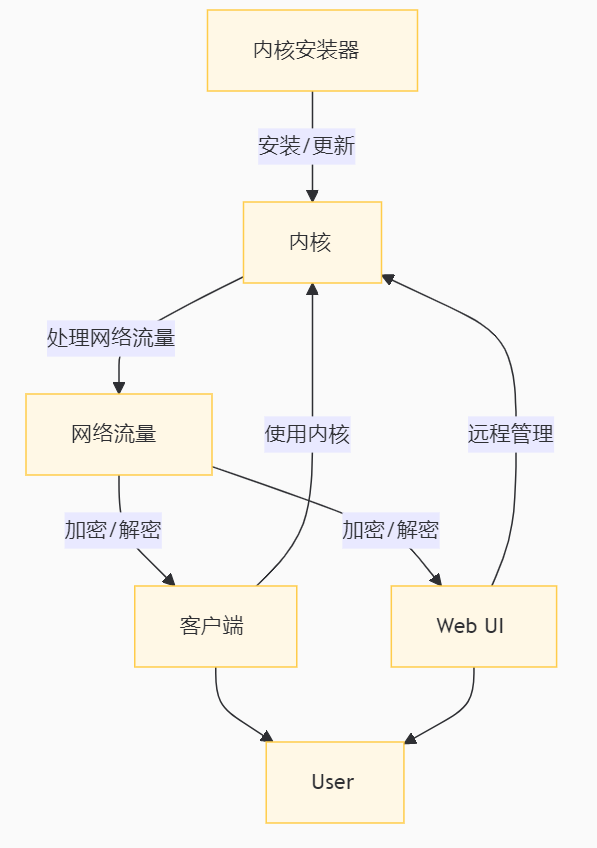

# 关于Clash系代理服务器

客户端的网址：https://www.clashverge.dev/


https://www.clashverge.dev/friendship.html

可以看看上面的链接。

```
graph TD
    Kernel[内核] -->|处理网络流量| Traffic[网络流量]
    Client[客户端] -->|使用内核| Kernel
    WebUI[Web UI] -->|远程管理| Kernel
    Installer[内核安装器] -->|安装/更新| Kernel
    Traffic -->|加密/解密| Client
    Traffic -->|加密/解密| WebUI
    Client --> User
    WebUI --> User
```

大概是这么个东西



不玩自建机场的，下载客户端就行了，在订阅那里输入买来的url就行了。

玩自建机场的，还要去部署服务器端。配置方法：[在系统中安装并配置 Clash 使用 V2Ray 服务器](在系统中安装并配置%20Clash%20使用%20V2Ray%20服务器.md)